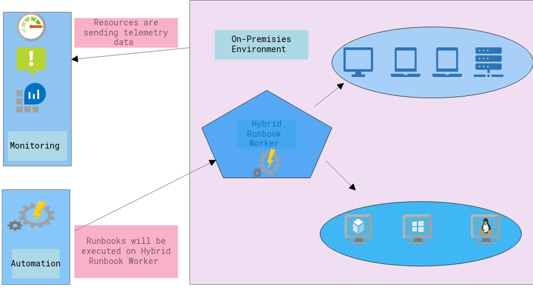
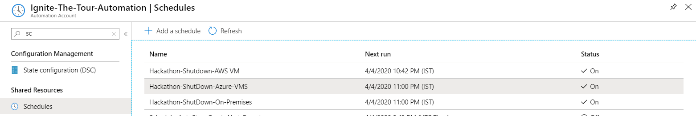

[TOC]

#### Introduction

As per some independent research, if the computer is on for eight hours a day then it uses almost 600 kWh and emits 175 kg of CO2 per year. A laptop uses between 50 and 100 W/hour when it is being used, depending on the model. A laptop that is on for eight hours a day uses between 150 and 300 kWh and emits between 44 and 88 kg of CO2 per year. 

Quite often we see the servers, desktops and other devices are up and running during non-business hours. By turning off the servers\desktops\other device during non-business hours we can limit the carbon emission. If the servers are running in the datacenter then we need some energy to maintain the "Cooling". But, if the non-essential servers are not running then we need very less amount of cooling in DataCenter. Hence we are saving the electricity and making less carbon foot print. 

This solution is not limited to the resources running in the Azure Cloud. It can easily control the Servers\Desktops running 'On-Premises' , 'any other cloud platform like AWS, GoogleCloud' , 'Local DataCenter' , etc. 

With the help of "Azure Monitor" , "Azure Automation" , "Azure Hybrid Runbook worker" we can build a "Full Stack Solution" that will identify the devices which are not required during "non-business hours" and turn them off during non productive hours. 

Azure Monitor will be used here for monitoring and Azure Automation will be used for controlling the devices. With this solution lot of electricity can be saved and eventually it will reduce the Carbon foot print.


#### Project Video 

| Location                                                 | Link                                                         |
| -------------------------------------------------------- | ------------------------------------------------------------ |
| **Onedrive<br /><br />Use this link for watching video** | https://1drv.ms/v/s!AtaahoqRQxFCh81NCeg1ls5HwX-7OQ?e=94KnHz  |
| Github                                                   | https://github.com/Keshav1308/Hack-For-Environment/blob/master/Hack-For-Environment-01.mp4?raw=true |


#### Solution Design

Our solution will make use of the following Azure Components. 

| Azure Component             | Description                                                  |
| --------------------------- | ------------------------------------------------------------ |
| Azure Monitor               | Azure Monitor maximizes the availability and performance of your applications and services by delivering a comprehensive solution for collecting, analyzing, and acting on telemetry from your cloud and on-premises environments.<br /><br /><br />In this solution Azure Monitor is used to monitor the usage of the machines. Also, here Azure monitor will integrate with Azure Automation. |
| Azure Automation            | Azure Automation delivers a cloud-based automation and configuration service that provides consistent management across your Azure and non-Azure environments. Azure Automation provides you the ability to automate frequent, time-consuming, and error-prone cloud management tasks.<br /><br />Azure Automation is used here to run the code for Shutting down the machines during non-business hours. |
| Azure Hybrid Runbook Worker | Hybrid Runbook Worker feature of Azure Automation can directly run runbooks on the computer that's hosting the role and against resources in the environment to manage those local resources. <br /><br />Hybrid Runbook Worker is used here to run the code directly of the on-premises machines.  This will also allow us to execute the code on the machines which resided on the on-premises infrastructure. |




Machines will be sending telemetry data to Azure Monitor. This data will help us in analyzing the usage and requirement of the particular devices.  

**Availability chart of the machines for last 12 hours.**** 

 
 
 **Performance chart of the machines for last 12 hours.** 


Based on this telemetry data we can identify whether that device is needed during off hours or we can safely turn it off.

Once the machine is identified we can initiate the runbook to shutdown it during non business hours. Most of the resources are located in on-premises infrastructure.  So for communicating with these machines Hybrid Runbook worker will be used.  Runbook code will be executed on the HRW. Schedules will be created for executing the Runbooks at specific time. 


 **Runbooks for Turing-Off the machines.** 


 **Schedules for executing the Runbooks at specific times** 



##### 

#### Implementation steps 

Below are high level  instructions for deployment of our solution.  This solution can also uses the existing resources.  For each steps please refer the Microsoft documentation for installing the components. 

- First create the Log Analytics Workspace.
  https://docs.microsoft.com/en-us/azure/azure-monitor/learn/quick-create-workspace
  
  

- Deploy the monitoring agent on the machines which we want to control. There are many ways of deploying the agents.  On Azure servers we just need to enable the extension and on the non azure servers  agent can be deployed manually, SCCM or event it can be added to the deployment image. 
  https://docs.microsoft.com/en-us/azure/azure-monitor/platform/agent-windows

  

- Enable the collection of the data for  'Performance Counter'.

  https://docs.microsoft.com/en-us/azure/azure-monitor/platform/data-sources-performance-counters

  

- Dashboards  can be created for analyzing the data. Following KQL Queries can be used.
  https://docs.microsoft.com/en-us/azure/azure-monitor/platform/view-designer

  ```
  Heartbeat | summarize heartbeatPerHour = count() by bin_at(TimeGenerated, 1h, ago(24h)), Computer | extend availablePerHour = iff(heartbeatPerHour > 0, true, false) | summarize totalAvailableHours = countif(availablePerHour == true) by Computer | extend availabilityRate = totalAvailableHours*100.0/24 | render piechart 
  ```

  ```
  Perf | where TimeGenerated >= now(-12h)  | where (CounterName == "% Processor Time") | project TimeGenerated, CounterName, CounterValue, Computer  | summarize count()  by Computer | render piechart 
  ```

  

- Create the Azure Automation accounts. 
  https://docs.microsoft.com/en-us/azure/automation/automation-create-standalone-account

  

- Setup the Hybrid Runbook workers. 
  https://docs.microsoft.com/en-us/azure/automation/automation-windows-hrw-install

  

- Setup the Runbook. Copy the code from the code folders for setting up the Runbook. 
  https://docs.microsoft.com/en-us/azure/automation/manage-runbooks

  

- Create the schedules, which will execute the runbook at specific times. 
  https://docs.microsoft.com/en-us/azure/automation/manage-runbooks#scheduling-a-runbook-in-the-azure-portal

#### Security 

Azure Monitor and Azure Automation follows the standard security principal defined by Microsoft.  All communication between connected systems and the  Azure Monitor Log Analytics service is encrypted. The TLS (HTTPS) protocol is used for encryption. 

Hybrid Runbook Workers jobs run under the local System account on Windows servers. Also we can use Credential and Certificate assets in our runbook with cmdlets that allow us to specify credentials so that the runbook can authenticate to different resources.

#### Code 

|                               |                                                              |
| ----------------------------- | ------------------------------------------------------------ |
| Shutdown-AzureVM              | https://github.com/Keshav1308/Hack-For-Environment/blob/master/Hackathon-Shutdown-AzureVM.md |
| Hackathon-Shutdown-OnPremises | https://github.com/Keshav1308/Hack-For-Environment/blob/master/Hackathon-Shutdown-OnPremises.md |
| Hackathon-Shutdown-AWSVM      | https://github.com/Keshav1308/Hack-For-Environment/blob/master/code/Hackathon-Shutdown-AWSVM


#### Team 

|              |                                                              |
| ------------ | ------------------------------------------------------------ |
| Team Name    | Hack-For-Environment                                         |
| Team Members | Keshav Deo Jain  https://www.linkedin.com/in/keshav-jain-016427121/<br /> Nilankar Sen https://www.linkedin.com/in/nilankar-sen-b36589a4/ |

